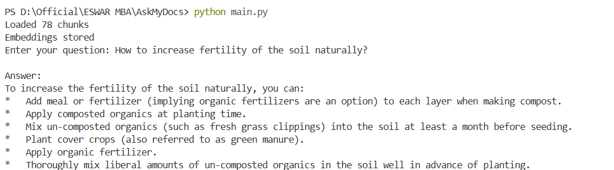

# RAG Pipeline using Gemini API and FAISS

A Python project that answers questions from your own documents using Retrieval-Augmented Generation (RAG).

---

## What it does

You give it your documents (PDF or TXT), ask a question, and it finds the most relevant parts of those documents and uses Google Gemini to give you an answer — based only on your content.

---

## Output



---

## Files

| File | What it does |
|---|---|
| `config.py` | API key and settings |
| `document_loader.py` | Reads and chunks PDF and TXT files |
| `embeddings.py` | Converts text into vectors using Gemini |
| `vector_store.py` | Stores and searches vectors using FAISS |
| `retrieval.py` | Finds the most relevant chunks for a query |
| `generation.py` | Sends context + question to Gemini for an answer |
| `main.py` | Runs the full pipeline |

---

## How to run

1. Install dependencies
```
pip install -r requirements.txt
```

2. Set your Gemini API key
```
export GEMINI_API_KEY="your-key-here"
```

3. Add your documents to the `documents/` folder

4. Run
```
python main.py
```

---

## Tech Stack

- Python
- Google Gemini API (gemini-embedding-001 + gemini-2.5-flash)
- FAISS (vector similarity search)
- NumPy
- pypdf

---

## What I learned

- How RAG pipelines work end to end
- How embeddings represent text as vectors
- How FAISS indexes and searches vectors efficiently
- How to use the Gemini API for both embeddings and text generation
